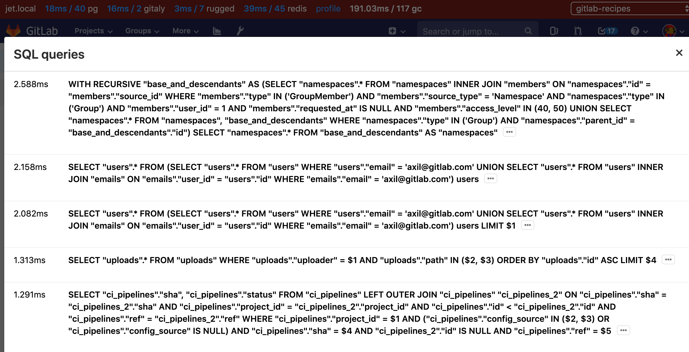
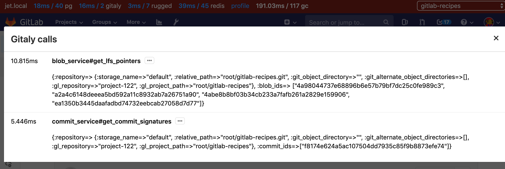
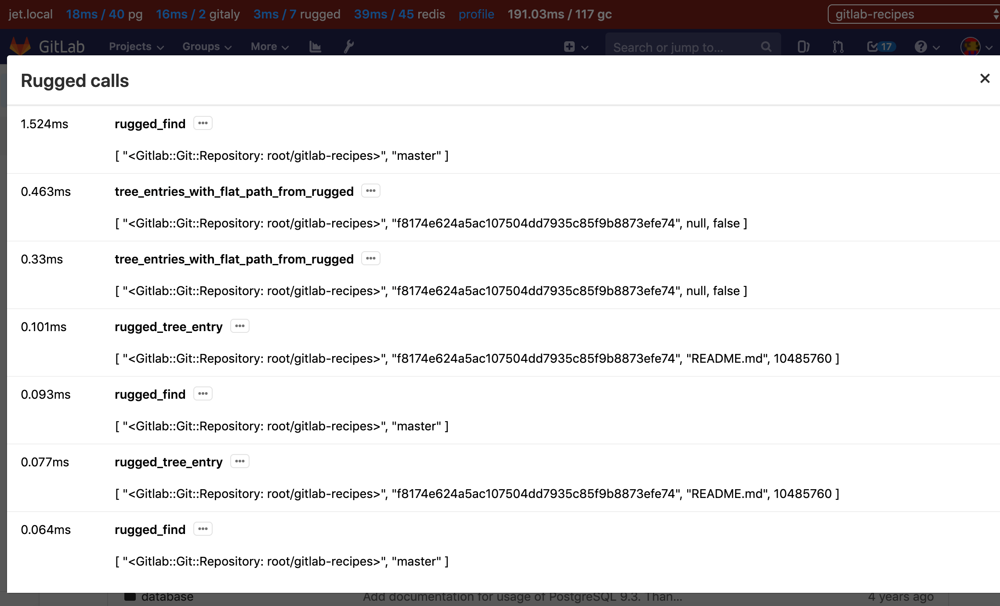
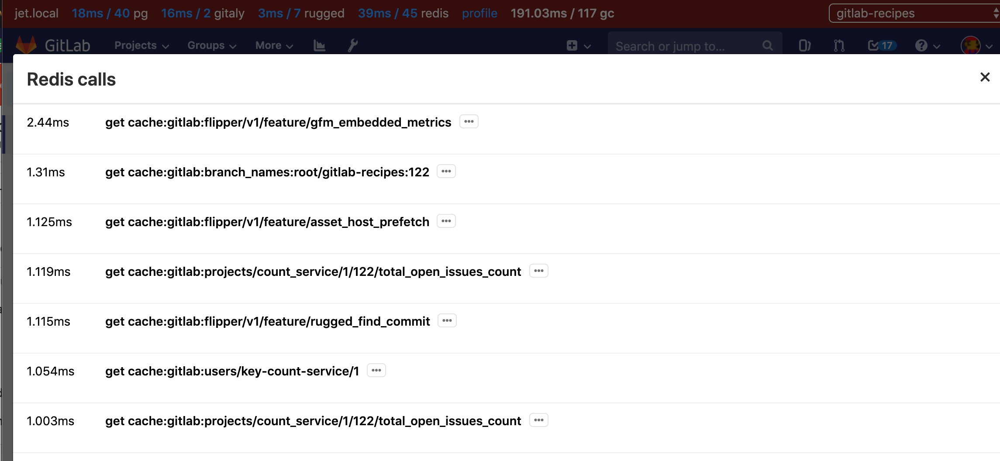

# Performance Bar

A Performance Bar can be displayed, to dig into the performance of a page. When
activated, it looks as follows:

It allows you to see (from left to right):

- the current host serving the page
- time taken and number of DB queries, click through for details of these queries
  
- time taken and number of [Gitaly] calls, click through for details of these calls
  
- time taken and number of [Rugged] calls, click through for details of these calls
  
- profile of the code used to generate the page, line by line. In the profile view, the numbers in the left panel represent wall time, cpu time, and number of calls (based on [rblineprof](https://github.com/tmm1/rblineprof)).
  
- time taken and number of Redis calls, click through for details of these calls
  
- time taken and number of Ruby GC calls

On the far right is a request selector that allows you to view the same metrics
(excluding the page timing and line profiler) for any requests made while the
page was open. Only the first two requests per unique URL are captured.

## Enable the Performance Bar via the Admin panel

GitLab Performance Bar is disabled by default. To enable it for a given group,
navigate to the Admin area in **Settings > Metrics and Profiling > Profiling - Performance bar**
(`admin/application_settings/metrics_and_profiling`).

The only required setting you need to set is the full path of the group that
will be allowed to display the Performance Bar.
Make sure _Enable the Performance Bar_ is checked and hit
**Save** to save the changes.

Once the Performance Bar is enabled, you will need to press the [<kbd>p</kbd> +
<kbd>b</kbd> keyboard shortcut](../../../workflow/shortcuts.md) to actually
display it.

You can toggle the Bar using the same shortcut.

[Gitaly]: ../../gitaly/index.md
[Rugged]: ../../high_availability/nfs.md#improving-nfs-performance-with-gitlab
