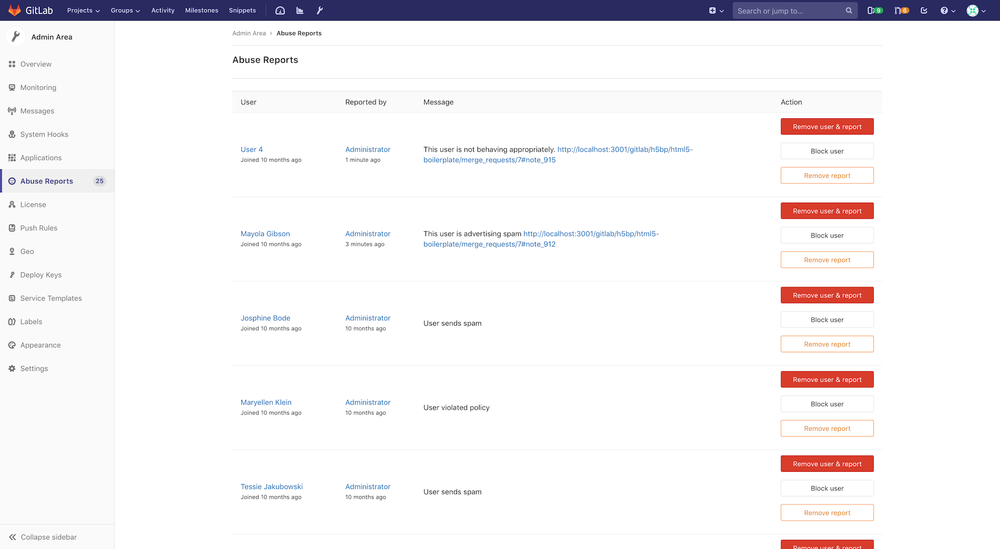

# Abuse reports

View and resolve abuse reports from GitLab users.

GitLab administrators can view and [resolve](#resolving-abuse-reports) abuse
reports in the Admin Area.

## Reporting abuse

To find out more about reporting abuse, see [abuse reports user
documentation](../abuse_reports.md).

## Resolving abuse reports

To access abuse reports, go to **Admin Area > Abuse Reports**.

There are 3 ways to resolve an abuse report, with a button for each method:

- Remove user & report. This will:
  - [Delete the reported user](../profile/account/delete_account.md) from the
    instance.
  - Remove the abuse report from the list.
- [Block user](#blocking-users).
- Remove report. This will:
  - Remove the abuse report from the list.
  - Remove access restrictions for the reported user.

The following is an example of the **Abuse Reports** page:



### Blocking users

A blocked user cannot log in or access any repositories, but all of their data
remains.

Blocking a user:

- Leaves them in the abuse report list.
- Changes the **Block user** button to a disabled **Already blocked** button.

The user will be notified with the
[following message](https://gitlab.com/gitlab-org/gitlab-ee/blob/master/app/workers/email_receiver_worker.rb#L38):

```text
Your account has been blocked. If you believe this is in error, contact a staff member.
```

After blocking, you can still either:

- Remove the user and report if necessary.
- Remove the report.

The following is an example of a blocked user listed on the **Abuse Reports**
page:


NOTE: **Note:**
Users can be [blocked](../../api/users.md#block-user) and
[unblocked](../../api/users.md#unblock-user) using the GitLab API.
