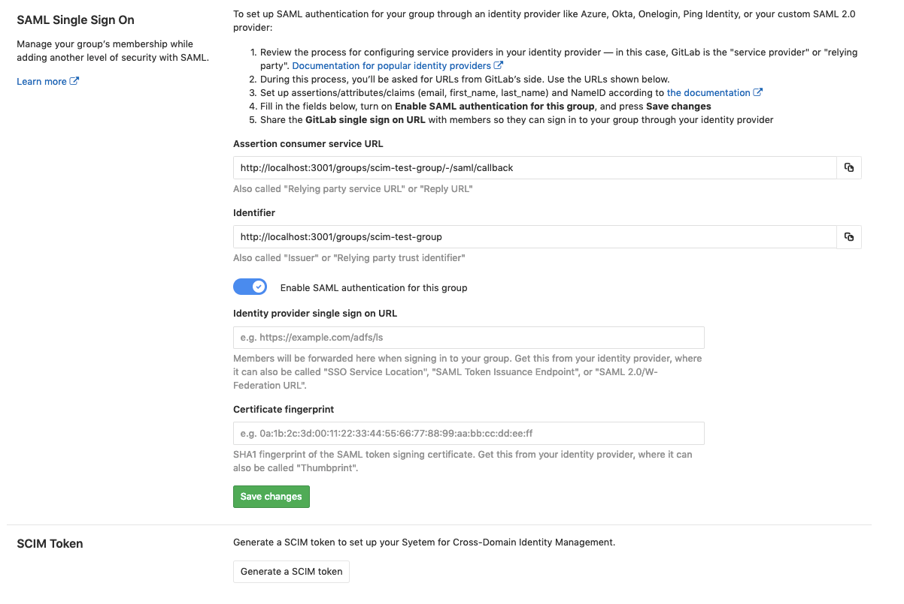
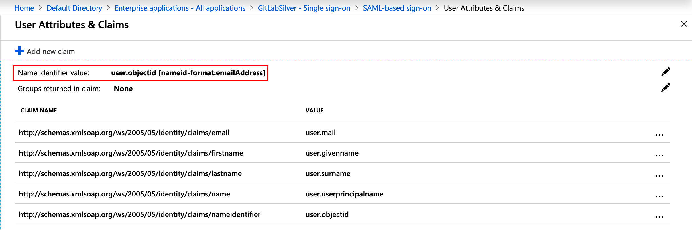
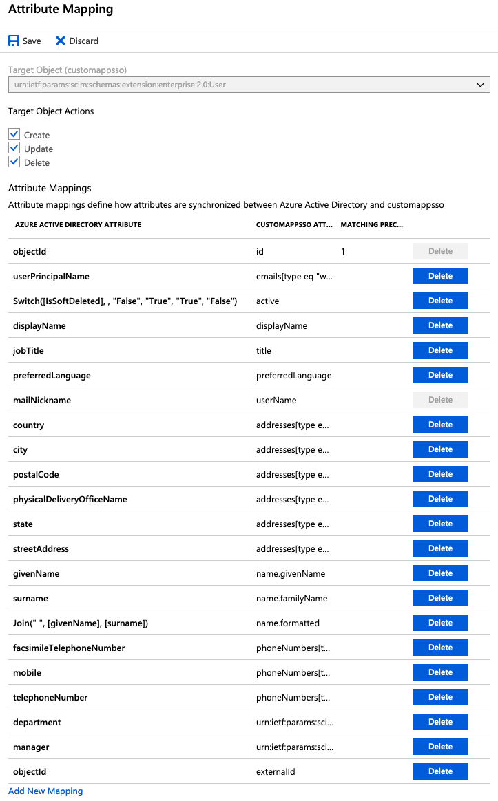

# SCIM provisioning using SAML SSO for Groups **(SILVER ONLY)**

> [Introduced](https://gitlab.com/gitlab-org/gitlab-ee/merge_requests/9388) in [GitLab.com Silver](https://about.gitlab.com/pricing/) 11.10.

System for Cross-domain Identity Management (SCIM), is an open standard that enables the
automation of user provisioning. When SCIM is provisioned for a GitLab group, membership of
that group is synchronized between GitLab and the identity provider.

GitLab's [SCIM API](../../../api/scim.md) implements part of [the RFC7644 protocol](https://tools.ietf.org/html/rfc7644).

Currently, the following actions are available:

- CREATE
- UPDATE
- DELETE (deprovisioning)

The following identity providers are supported:

- Azure

## Requirements

- [Group SSO](index.md) needs to be configured.
- The `scim_group` feature flag must be enabled:

  Run the following commands in a Rails console:

  ```sh
  # Omnibus GitLab
  gitlab-rails console

  # Installation from source
  cd /home/git/gitlab
  sudo -u git -H bin/rails console RAILS_ENV=production
  ```

  To enable SCIM for a group named `group_name`:

  ```ruby
  group = Group.find_by_full_path('group_name')
  Feature.enable(:group_scim, group)
  ```

## GitLab configuration

Once [Single sign-on](index.md) has been configured, we can:

1. Navigate to the group and click **Settings > SAML SSO**.
1. Click on the **Generate a SCIM token** button.
1. Save the token and URL so they can be used in the next step.



## Identity Provider configuration

### Azure

First, double check the [Single sign-on](index.md) configuration for your group and ensure that **Name identifier value** (NameID) points to `user.objectid` or another unique identifier. This will match the `extern_uid` used on GitLab.



#### Set up admin credentials

Next, configure your GitLab application in Azure by following the
[Provisioning users and groups to applications that support SCIM](https://docs.microsoft.com/en-us/azure/active-directory/manage-apps/use-scim-to-provision-users-and-groups#provisioning-users-and-groups-to-applications-that-support-scim) 
section in Azure's SCIM setup documentation.

During this configuration, note the following:

- The `Tenant URL` and `secret token` are the ones retrieved in the
  [previous step](#gitlab-configuration).
- Should there be any problems with the availability of GitLab or similar
  errors, the notification email set will get those.
- It is recommended to set a notification email and check the **Send an email notification when a failure occurs** checkbox.
- For mappings, we will only leave `Synchronize Azure Active Directory Users to AppName` enabled.

You can then test the connection by clicking on **Test Connection**. If the connection is successful, be sure to save your configuration before moving on.

#### Configure attribute mapping

1. Click on `Synchronize Azure Active Directory Users to AppName`, to configure the attribute mapping.
1. Click **Delete** next to the `mail` mapping.
1. Map `userPrincipalName` to `emails[type eq "work"].value` and change it's **Matching precedence** to `2`.
1. Map `mailNickname` to `userName`.
1. Create a new mapping by clicking **Add New Mapping** then set **Source attribute** to `objectId`, **Target attribute** to `id`, **Match objects using this attribute** to `Yes`, and **Matching precedence** to `1`.
1. Create a new mapping by clicking **Add New Mapping** then set **Source attribute** to `objectId`, and **Target attribute** to `externalId`.
1. Click the `userPrincipalName` mapping and change **Match objects using this attribute** to `No`.

    Save your changes and you should have the following configuration:

   

    NOTE: **Note:** If you used a unique identifier **other than** `objectId`, be sure to map it instead to both `id` and `externalId`.

1. Below the mapping list click on **Show advanced options > Edit attribute list for AppName**.
1. Leave the `id` as the primary and only required field.

   NOTE: **Note:**
   `username` should neither be primary nor required as we don't support
   that field on GitLab SCIM yet.

   

1. Save all the screens and, in the **Provisioning** step, set
   the `Provisioning Status` to `On`.

    

   NOTE: **Note:**
   You can control what is actually synced by selecting the `Scope`. For example,
   `Sync only assigned users and groups` will only sync the users assigned to
   the application (`Users and groups`), otherwise, it will sync the whole Active Directory.

Once enabled, the synchronization details and any errors will appear on the
bottom of the **Provisioning** screen, together with a link to the audit logs.

<!-- ## Troubleshooting

Include any troubleshooting steps that you can foresee. If you know beforehand what issues
one might have when setting this up, or when something is changed, or on upgrading, it's
important to describe those, too. Think of things that may go wrong and include them here.
This is important to minimize requests for support, and to avoid doc comments with
questions that you know someone might ask.

Each scenario can be a third-level heading, e.g. `### Getting error message X`.
If you have none to add when creating a doc, leave this section in place
but commented out to help encourage others to add to it in the future. -->
