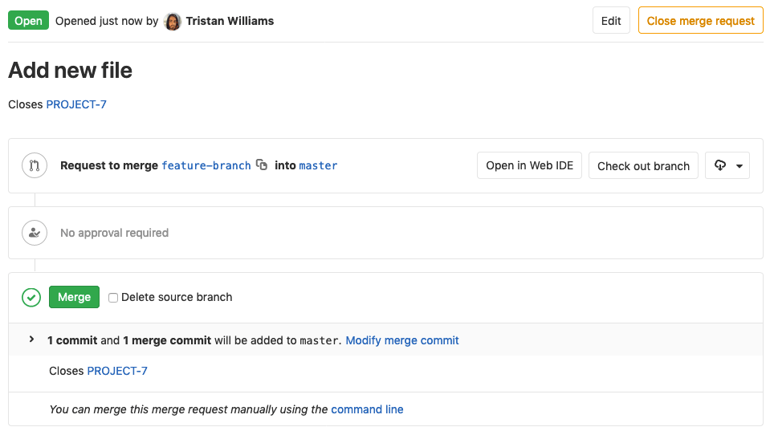
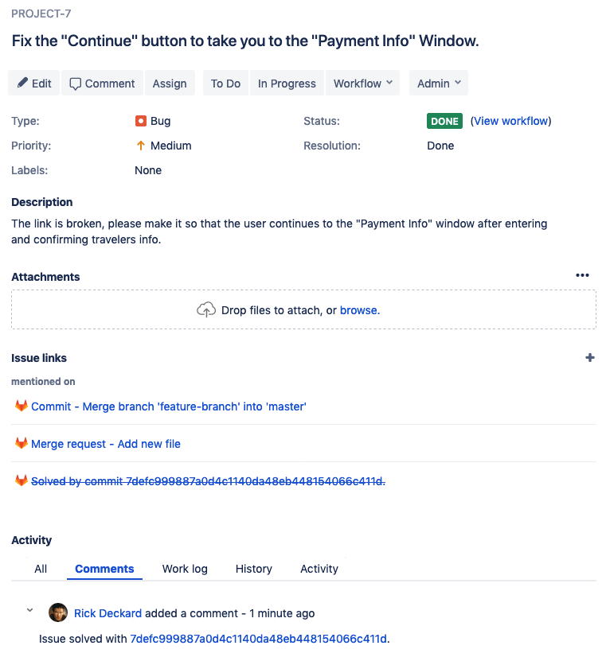

# GitLab Jira integration

GitLab Issues are a powerful tool for discussing ideas and planning and tracking work.
However, many organizations have been using Jira for these purposes and have
extensive data and business processes built into it.

While you can always migrate content and process from Jira to GitLab Issues,
you can also opt to continue using Jira and use it together with GitLab through
our integration.

For a video demonstration of integration with Jira, watch [GitLab workflow with Jira issues and Jenkins pipelines](https://youtu.be/Jn-_fyra7xQ).

Once you integrate your GitLab project with your Jira instance, you can automatically
detect and cross-reference activity between the GitLab project and any of your projects
in Jira. This includes the ability to close or transition Jira issues when the work
is completed in GitLab.

Here's how the integration responds when you take the following actions in GitLab:

- **Mention a Jira issue ID** in a commit message or MR (merge request).
  - GitLab hyperlinks to the Jira issue.
  - The Jira issue adds an issue link to the commit/MR in GitLab.
  - The Jira issue adds a comment reflecting the comment made in GitLab, the comment author, and a link to the commit/MR in GitLab.
- **Mention that a commit or MR 'closes', 'resolves', or 'fixes' a Jira issue ID**. When the commit is made on master or the change is merged to master:
  - GitLab's merge request page displays a note that it "Closed" the Jira issue, with a link to the issue. (Note: Before the merge, an MR will display that it "Closes" the Jira issue.)
  - The Jira issue shows the activity and the Jira issue is closed, or otherwise transitioned.

You can also use [Jira's Smart Commits](https://confluence.atlassian.com/fisheye/using-smart-commits-298976812.html)
directly from GitLab, as covered in the article
[How and why to integrate GitLab with Jira](https://www.programmableweb.com/news/how-and-why-to-integrate-gitlab-Jira/how-to/2017/04/25).

## Configuration

Each GitLab project can be configured to connect to an entire Jira instance. That
means one GitLab project can interact with _all_ Jira projects in that instance, once
configured. Therefore, you will not have to explicitly associate
a GitLab project with any single Jira project.

If you have one Jira instance, you can pre-fill the settings page with a default
template. See the [Services Templates][services-templates] docs.

Configuration happens via user name and password. Connecting to a Jira Server
via CAS is not possible.

In order to enable the Jira service in GitLab, you need to first configure the
project in Jira and then enter the correct values in GitLab.

### Configuring Jira

When connecting to **Jira Server**, which supports basic authentication, a **username and password** are required. Check the link below and proceed to the next step:

- [Setting up a user in Jira Server](jira_server_configuration.md)

When connecting to **Jira Cloud**, which supports authentication via API token, an **email and API token**, are required. Check the link below and proceed to the next step:

- [Setting up a user in Jira Cloud](jira_cloud_configuration.md)

### Configuring GitLab

> **Notes:**
>
> - The currently supported Jira versions are `v6.x` and `v7.x.`. GitLab 7.8 or
>   higher is required.
> - GitLab 8.14 introduced a new way to integrate with Jira which greatly simplified
>   the configuration options you have to enter. If you are using an older version,
>   [follow this documentation][jira-repo-old-docs].
> - In order to support Oracle's Access Manager, GitLab will send additional cookies
>   to enable Basic Auth. The cookie being added to each request is `OBBasicAuth` with
>   a value of `fromDialog`.

To enable Jira integration in a project, navigate to the
[Integrations page](project_services.md#accessing-the-project-services), click
the **Jira** service, and fill in the required details on the page as described
in the table below.

| Field | Description |
| ----- | ----------- |
| `Web URL` | The base URL to the Jira instance web interface which is being linked to this GitLab project. E.g., `https://Jira.example.com`. |
| `Jira API URL` | The base URL to the Jira instance API. Web URL value will be used if not set. E.g., `https://jira-api.example.com`. |
| `Username/Email` | Created when [configuring Jira step](#configuring-jira). Use `username` for **Jira Server** or `email` for **Jira Cloud**. |
| `Password/API token` |Created in [configuring Jira step](#configuring-jira). Use `password` for **Jira Server** or `API token` for **Jira Cloud**. |
| `Transition ID` | This is the ID of a transition that moves issues to the desired state. It is possible to insert transition ids separated by `,` or `;` which means the issue will be moved to each state after another using the given order.  **Closing Jira issues via commits or Merge Requests won't work if you don't set the ID correctly.** |

### Obtaining a transition ID

In the most recent Jira user interface, you can no longer see transition IDs in the workflow
administration UI. You can get the ID you need in either of the following ways:

1. By using the API, with a request like `https://yourcompany.atlassian.net/rest/api/2/issue/ISSUE-123/transitions`
   using an issue that is in the appropriate "open" state
1. By mousing over the link for the transition you want and looking for the
   "action" parameter in the URL

Note that the transition ID may vary between workflows (e.g., bug vs. story),
even if the status you are changing to is the same.

After saving the configuration, your GitLab project will be able to interact
with all Jira projects in your Jira instance and you'll see the Jira link on the GitLab project pages that takes you to the appropriate Jira project.


## Jira issues

By now you should have [configured Jira](#configuring-jira) and enabled the
[Jira service in GitLab](#configuring-gitlab). If everything is set up correctly
you should be able to reference and close Jira issues by just mentioning their
ID in GitLab commits and merge requests.

### Referencing Jira Issues

When GitLab project has Jira issue tracker configured and enabled, mentioning
Jira issue in GitLab will automatically add a comment in Jira issue with the
link back to GitLab. This means that in comments in merge requests and commits
referencing an issue, e.g., `PROJECT-7`, will add a comment in Jira issue in the
format:

```
USER mentioned this issue in RESOURCE_NAME of [PROJECT_NAME|LINK_TO_COMMENT]:
ENTITY_TITLE
```

- `USER` A user that mentioned the issue. This is the link to the user profile in GitLab.
- `LINK_TO_THE_COMMENT` Link to the origin of mention with a name of the entity where Jira issue was mentioned.
- `RESOURCE_NAME` Kind of resource which referenced the issue. Can be a commit or merge request.
- `PROJECT_NAME` GitLab project name.
- `ENTITY_TITLE` Merge request title or commit message first line.


### Closing Jira Issues

Jira issues can be closed directly from GitLab by using trigger words in
commits and merge requests. When a commit which contains the trigger word
followed by the Jira issue ID in the commit message is pushed, GitLab will
add a comment in the mentioned Jira issue and immediately close it (provided
the transition ID was set up correctly).

There are currently three trigger words, and you can use either one to achieve
the same goal:

- `Resolves PROJECT-1`
- `Closes PROJECT-1`
- `Fixes PROJECT-1`

where `PROJECT-1` is the issue ID of the Jira project.

> **Notes:**
>
> - Only commits and merges into the project's default branch (usually **master**) will
>   close an issue in Jira. You can change your projects default branch under
>   [project settings](img/jira_project_settings.png).
> - The Jira issue will not be transitioned if it has a resolution.

### Jira issue closing example

Let's consider the following example:

1. For the project named `PROJECT` in Jira, we implemented a new feature
   and created a merge request in GitLab.
1. This feature was requested in Jira issue `PROJECT-7` and the merge request
   in GitLab contains the improvement
1. In the merge request description we use the issue closing trigger
   `Closes PROJECT-7`.
1. Once the merge request is merged, the Jira issue will be automatically closed
   with a comment and an associated link to the commit that resolved the issue.

In the following screenshot you can see what the link references to the Jira
issue look like.



Once this merge request is merged, the Jira issue will be automatically closed
with a link to the commit that resolved the issue.




## Troubleshooting

If these features do not work as expected, it is likely due to a problem with the way the integration settings were configured.

### GitLab is unable to comment on a Jira issue

Make sure that the Jira user you set up for the integration has the
correct access permission to post comments on a Jira issue and also to transition
the issue, if you'd like GitLab to also be able to do so.
Jira issue references and update comments will not work if the GitLab issue tracker is disabled.

### GitLab is unable to close a Jira issue

Make sure the `Transition ID` you set within the Jira settings matches the one
your project needs to close an issue.

Make sure that the Jira issue is not already marked as resolved; that is,
the Jira issue resolution field is not set. (It should not be struck through in
Jira lists.)

### CAPTCHA

CAPTCHA may be triggered after several consecutive failed login attempts
which may lead to a `401 unauthorized` error when testing your Jira integration.
If CAPTCHA has been triggered, you will not be able to use Jira's REST API to
authenticate with the Jira site. You will need to log in to your Jira instance
and complete the CAPTCHA.

[services-templates]: services_templates.md
[jira-repo-old-docs]: https://gitlab.com/gitlab-org/gitlab-ce/blob/8-13-stable/doc/project_services/jira.md
