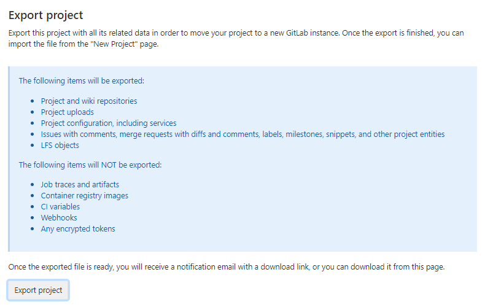
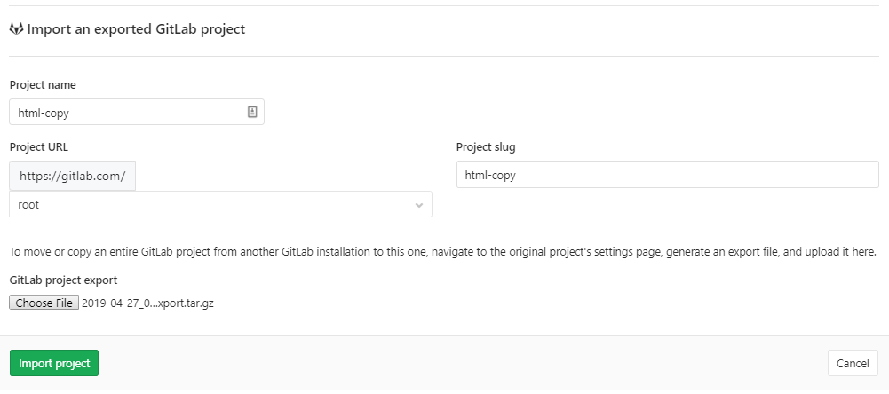

# Project import/export

>**Notes:**
>
> - [Introduced](https://gitlab.com/gitlab-org/gitlab-ce/issues/3050) in GitLab 8.9.
> - Importing will not be possible if the import instance version differs from
>   that of the exporter.
> - For GitLab admins, please read through
>   [Project import/export administration](../../../administration/raketasks/project_import_export.md).
> - For existing installations, the project import option has to be enabled in
>   application settings (`/admin/application_settings`) under 'Import sources'.
>   Ask your administrator if you don't see the **GitLab export** button when
>   creating a new project.
> - Starting with GitLab 10.0, administrators can disable the project export option
>   on the GitLab instance in application settings (`/admin/application_settings`)
>   under 'Visibility and Access Controls'.
> - You can find some useful raketasks if you are an administrator in the
>   [import_export](../../../administration/raketasks/project_import_export.md) raketask.
> - The exports are stored in a temporary [shared directory](../../../development/shared_files.md)
>   and are deleted every 24 hours by a specific worker.
> - Group members will get exported as project members, as long as the user has
>   maintainer or admin access to the group where the exported project lives. An admin
>   in the import side is required to map the users, based on email or username.
>   Otherwise, a supplementary comment is left to mention the original author and
>   the MRs, notes or issues will be owned by the importer.
> - Project members with owner access will get imported as maintainers.
> - Control project Import/Export with the [API](../../../api/project_import_export.md).
> - If an imported project contains merge requests originated from forks,
>   then new branches associated with such merge requests will be created
>   within a project during the import/export. Thus, the number of branches
>   in the exported project could be bigger than in the original project.

Existing projects running on any GitLab instance or GitLab.com can be exported
with all their related data and be moved into a new GitLab instance.

## Version history

| GitLab version   | Import/Export version |
| ---------------- | --------------------- |
| 11.1 to current  | 0.2.4                 |
| 10.8             | 0.2.3                 |
| 10.4             | 0.2.2                 |
| 10.3             | 0.2.1                 |
| 10.0             | 0.2.0                 |
| 9.4.0            | 0.1.8                 |
| 9.2.0            | 0.1.7                 |
| 8.17.0           | 0.1.6                 |
| 8.13.0           | 0.1.5                 |
| 8.12.0           | 0.1.4                 |
| 8.10.3           | 0.1.3                 |
| 8.10.0           | 0.1.2                 |
| 8.9.5            | 0.1.1                 |
| 8.9.0            | 0.1.0                 |

 > The table reflects what GitLab version we updated the Import/Export version at.
 > For instance, 8.10.3 and 8.11 will have the same Import/Export version (0.1.3)
 > and the exports between them will be compatible.

## Exported contents

The following items will be exported:

- Project and wiki repositories
- Project uploads
- Project configuration, including services
- Issues with comments, merge requests with diffs and comments, labels, milestones, snippets,
  and other project entities
- LFS objects

The following items will NOT be exported:

- Build traces and artifacts
- Container registry images
- CI variables
- Webhooks
- Any encrypted tokens
- Merge Request Approvers
- Push Rules
- Awards

NOTE: **Note:**
For more details on the specific data persisted in a project export, see the
[`import_export.yml`](https://gitlab.com/gitlab-org/gitlab-ee/blob/master/lib/gitlab/import_export/import_export.yml) file.

## Exporting a project and its data

1. Go to your project's homepage.

1. Click **Settings** in the sidebar.

1. Scroll down to find the **Export project** button:

   

1. Once the export is generated, you should receive an e-mail with a link to
   download the file:

   

1. Alternatively, you can come back to the project settings and download the
   file from there, or generate a new export. Once the file available, the page
   should show the **Download export** button:

   

## Importing the project

1. The GitLab project import feature is the first import option when creating a
   new project. Click on **GitLab export**:

   

1. Enter your project name and URL. Then select the file you exported previously:

   

1. Click on **Import project** to begin importing. Your newly imported project
   page will appear soon.

NOTE: **Note:**
If use of the `Internal` visibility level
[is restricted](../../../public_access/public_access.md#restricting-the-use-of-public-or-internal-projects),
all imported projects are given the visibility of `Private`.
